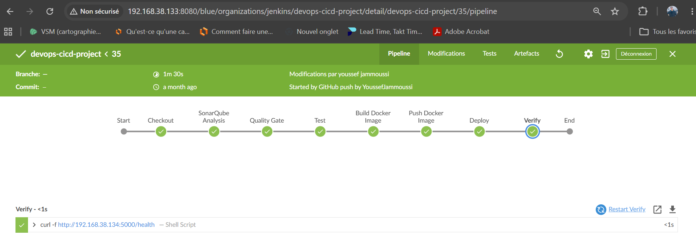
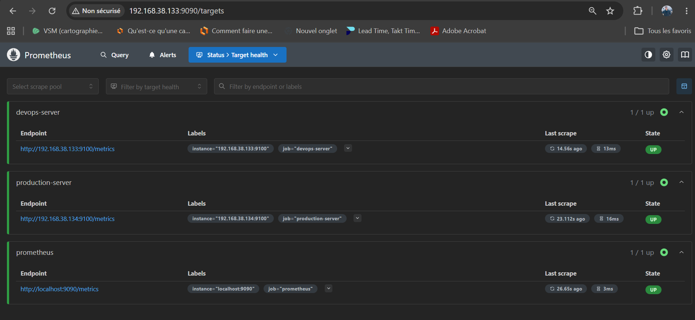
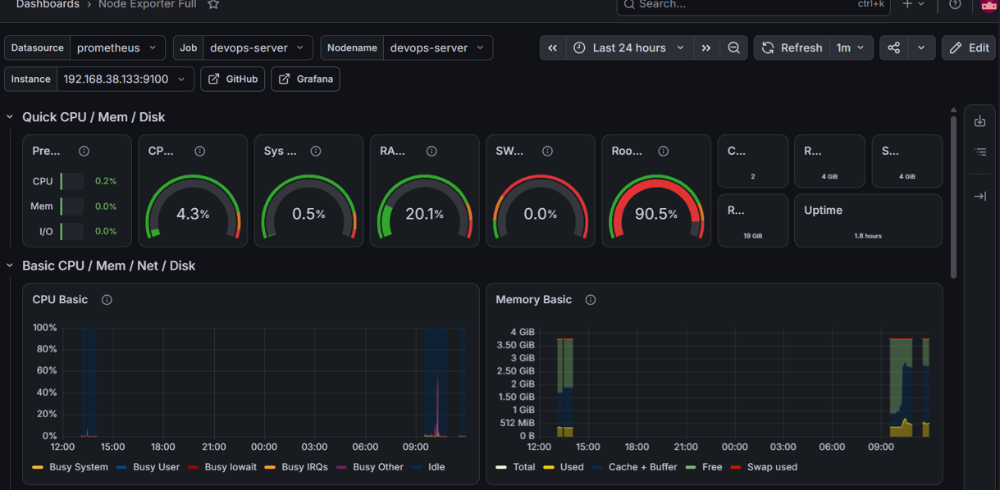
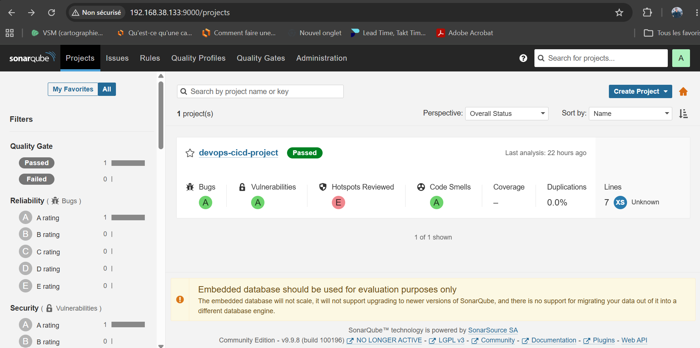
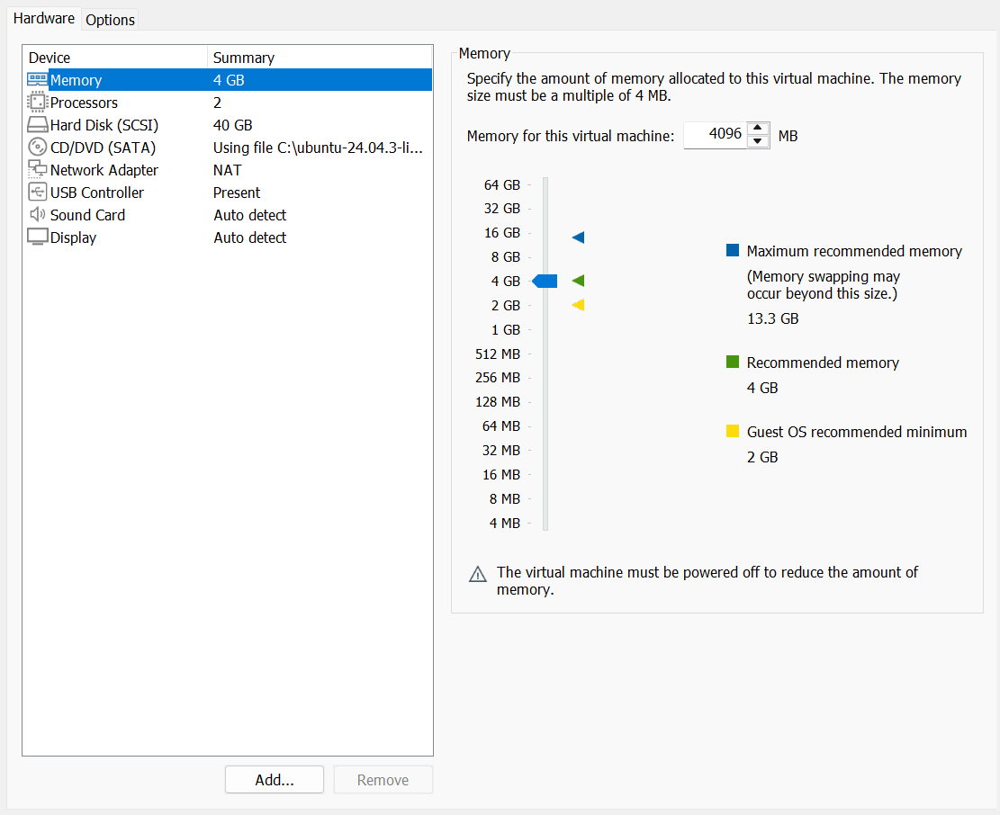
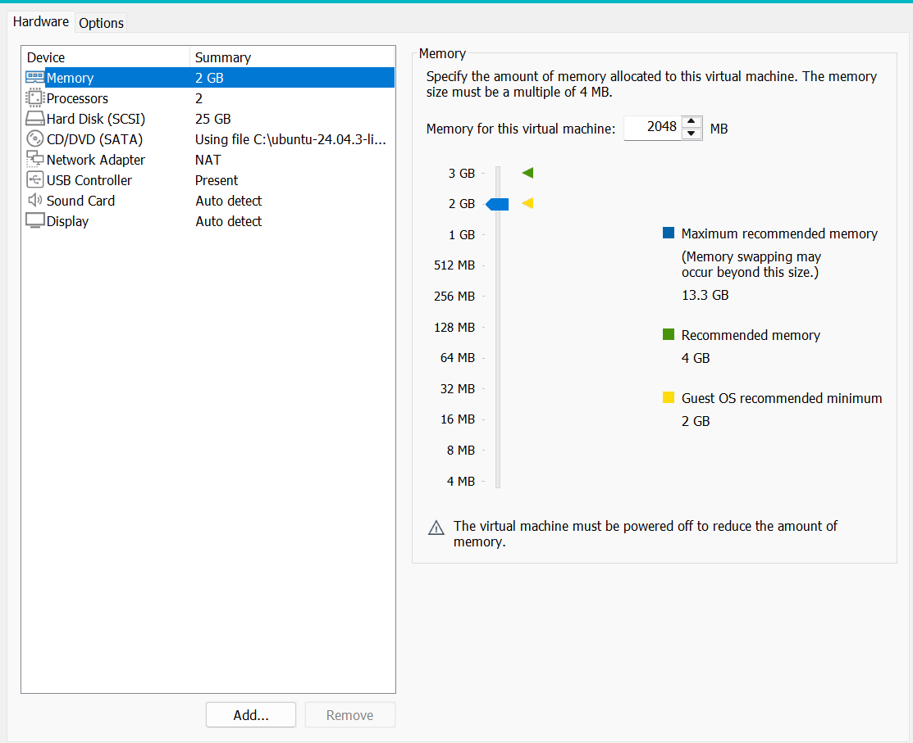

# 🚀 DevOps CI/CD Pipeline Project

A production-ready DevOps CI/CD pipeline demonstrating automated build, testing, code quality analysis, deployment, and monitoring using industry-standard tools.

---

## 📖 Project Overview

### About the Project


This repository demonstrates a complete DevOps CI/CD pipeline built around a containerized web application. It showcases how modern DevOps practices can automate the entire software delivery lifecycle, from source code integration to production deployment and infrastructure monitoring.

The project simulates a real-world production environment using two Ubuntu virtual machines: one dedicated to the DevOps toolchain and another acting as the production server. Every code change pushed to GitHub automatically triggers a Jenkins pipeline that validates the application, performs static code analysis with SonarQube, builds Docker images, publishes them to Docker Hub, deploys the latest version using Ansible and Docker Compose, and finally monitors the infrastructure with Prometheus and Grafana.

## 🏗️ Technology Stack

- **Frontend:** React.js
- **Backend:** Node.js & Express.js
- **Containerization:** Docker & Docker Compose
- **Version Control:** Git & GitHub
- **CI/CD:** Jenkins Pipeline
- **Configuration Management:** Ansible
- **Code Quality:** SonarQube
- **Monitoring:** Prometheus & Grafana
- **Operating System:** Ubuntu Server 22.04

## 🔄 Architecture Overview

```
                Developer
                    │
                Git Push
                    │
             GitHub Repository
                    │
            GitHub Webhook
                    │
              Jenkins (VM1)
                    │
        ┌───────────┼───────────┐
        │           │           │
     Testing   SonarQube   Docker Build
        │           │           │
        └───────────┼───────────┘
                    │
          Push Image to Docker Hub
                    │
              Ansible Deployment
                    │
         Production Server (VM2)
                    │
             Docker Compose
                    │
        ┌───────────┴───────────┐
        │                       │
   Frontend (React)     Backend (Node.js/Express)
                    │
        Prometheus + Grafana
        (Monitoring & Metrics)
```

---

# 🚀 Setup & Usage

### Clone the Repository

```bash
git clone https://github.com/<YoussefJammoussi>/devops-cicd-project.git
cd devops-cicd-project
```

### Start the Application

```bash
docker compose up -d
```

### Access the Services

- 🛠️ Jenkins → http://localhost:8080
- ⚙️ Backend API → http://localhost:5000
- 🔍 SonarQube → http://localhost:9000
- 📈 Prometheus → http://localhost:9090
- 📊 Grafana → http://localhost:3000

⚙️ CI/CD Pipeline (Jenkins)

📥 Checkout → Clone the latest source code from GitHub

🔍 SonarQube Analysis → Analyze code quality

🛡️ Quality Gate → Validate SonarQube quality criteria

🧪 Test → Execute automated tests

🐳 Build Docker Image → Build the backend Docker image

📤 Push Docker Image → Push the image to Docker Hub

🤖 Ansible Deployment → Jenkins executes an Ansible playbook to connect via SSH to the production server, pull the latest Docker image, and deploy the application automatically using Docker Compose.

✅ Verify → Check the application health endpoint (/health) after deployment



📊 Monitoring & Quality

Prometheus → Collects system & app metrics



Grafana → Dashboards for CPU, RAM, Disk, Network


SonarQube → Code analysis (bugs, vulnerabilities, smells)

## 🔍 SonarQube Analysis



🌱 Future Extensions

• Add Kubernetes deployment manifests to orchestrate containers.

• Integrate Helm charts for easier Kubernetes deployments.

• Extend monitoring with Alertmanager to send automatic alerts (Email/Slack) when issues are detected.

## 👨‍💻 Author

Developed & maintained by **Youssef Jammoussi**

🔗 GitHub: https://github.com/YoussefJammoussi

## 📂 Project Structure

```text
devops-cicd-project/
│
├── frontend/                      # React application
│   ├── public/
│   ├── src/
│   ├── .gitignore
│   ├── package.json
│   └── package-lock.json
│
├── backend/                       # Node.js / Express API
│   ├── Dockerfile
│   ├── .dockerignore
│   ├── package.json
│   ├── package-lock.json
│   └── server.js
│
├── ansible/                       # Ansible deployment automation
│   ├── inventory.ini
│   ├── deploy.yml
│   └── secrets.yml
│
├── monitoring/                    # Monitoring configuration
│   ├── prometheus/
│   │   ├── prometheus.yml
│   │   ├── prometheus.service
│   │   └── node_exporter.service
│   │
│   └── grafana/
│       ├── dashboards/
│       └── node-exporter-dashboard.md
│
├── docs/                          # Project documentation & screenshots
│   ├── screenshots/
│   │   ├── architecture.png
│   │   ├── devops-server.png
│   │   ├── production-server.png
│   │   ├── jenkins-pipeline.png
│   │   ├── sonarqube-dashboard.png
│   │   ├── prometheus-dashboard.png
│   │   └── grafana-dashboard.png
│   └── README.md
│
├── .env.example                   # Environment variables template
├── .gitignore                     # Git ignored files
├── docker-compose.yml             # Docker Compose deployment
├── Jenkinsfile                    # Jenkins CI/CD pipeline
├── README.md                      # Project documentation
└── sonar-project.properties       # SonarQube configuration
```

## 🛠️ Prerequisites

### VM1 – DevOps Server

The following tools should be installed:

- Git
- Docker & Docker Compose
- Jenkins
- SonarQube
- Prometheus
- Grafana
- Node Exporter
- Ansible
- Ngrok (for GitHub Webhooks)

### VM2 – Production Server

The following tools should be installed:

- Docker
- Docker Compose
- Node Exporter

### Development Environment

- Node.js & npm (React frontend and Node.js backend)
- GitHub Account
- Docker Hub Account

## 🧪 Testing

The application was validated using functional testing after deployment.

### Backend Verification

```bash
curl http://localhost:5000/health
```

Expected response:

```text
Backend API is running
```

### CI/CD Verification

After each deployment, the Jenkins pipeline verifies that the application is running correctly by checking the `/health` endpoint.
## 🚀 Running the Project

### Frontend

```bash
cd frontend
npm install
npm start
```

The React application will be available at:

```text
http://localhost:3000
```

### Backend

```bash
cd backend
npm install
node server.js
```

The backend API will be available at:

```text
http://localhost:5000
```

## 📦 Deployment Environments

| VM                          | Purpose                          | Specifications                 | IP Address     |
|-----------------------------|----------------------------------|--------------------------------|----------------|
| **VM1 – DevOps Server**     | CI/CD, Code Analysis, Monitoring | Ubuntu 22.04, 2 vCPU, 4 GB RAM | 192.168.38.133 |
| **VM2 – Production Server** | Application Deployment           | Ubuntu 22.04, 2 vCPU, 4 GB RAM | 192.168.38.134 |


## 📜 License

This project is licensed under the MIT License.